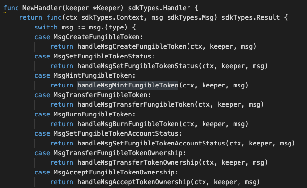

This is the msg type used to burn the item of fungible token.


## Parameters

The message type contains the following parameters:

| Name | Type | Required | Description                 |
| ---- | ---- | -------- | --------------------------- |
| symbol | string | true   | Token symbol, which must be unique| | 
| value | string | true   | value| | 
| itemID | string | true   | Properties of token| | 


#### Example

```
{
    "type": "token/burnFungibleToken",
    "value": {
        "symbol": "TT-2",
        "value": "200",
        "from": "mxw1x5cf8y99ntjc8cjm00z603yfqwzxw2mawemf73"
    }
}

```

## Handler

The role of the handler is to define what action(s) needs to be taken when this MsgTypeBurnFungibleToken message is received.

In the file (./x/token/fungible/handler.go) start with the following code:




NewHandler is essentially a sub-router that directs messages coming into this module to the proper handler.
Now, you need to define the actual logic for handling the MsgTypeBurnFungibleToken message in handleMsgBurnNonFungibleItem:


In this function, requirements need to be met before emitted by the network.  

* XXA valid Token.
* XXToken must be approved before this, and not be freeze. Also burnable flag must equals to true.
* XXA valid Item ID.
* XXSigner who is the Item owner need to be authorised to do this process.
* XXAction of Re-burn is not allowed.


## Events
This tutorial describes how to create maxonrow events for scanner on this after emitted by a network.

  


#### Usage
This MakeMxwEvents create maxonrow events, by accepting :

* Custom Event Signature : using BurnedFungibleToken(string,string,string,bignumber)
* Item owner
* Event Parameters as below: 

| Name | Type | Description                 |
| ---- | ---- | --------------------------- |
| symbol | string | Token symbol, which must be unique| | 
| owner | string | Item owner| | 
| account | string | Account address| | 
| value | string | value| | 

--ntyt ???
symbol, owner.String(), "mxw000000000000000000000000000000000000000", value.String()

